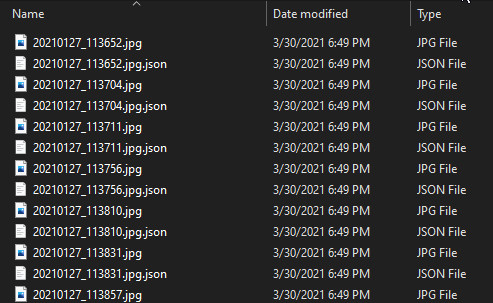
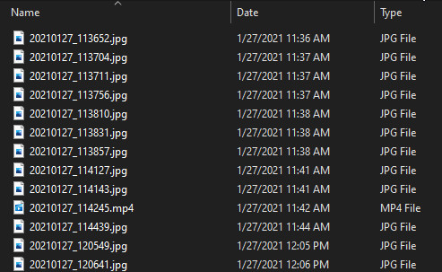

# Google_Photo_Exif_Encorder

Program that automatically corrects exif data and update date of photos exported from "Google Photo"  
Googleフォトからエクスポートした画像のExif情報やファイル更新日時を正しいものに一括で修正するプログラムです．  

## Description
There are problems that pictures exported from "Google Photo" by using ["Google Data Export"](https://takeout.google.com/?continue=https://myaccount.google.com/dashboard&hl=ja) have incorrect exif data and update date of photo, so that Album apps or gallary apps can't display photos correctly.

This program reads json file in exported folder and automatically corrects exif data and update date of photos at once.

JPG, PNG, MP4, GIF, 3GP, WEBP, JPEG are suppoted.

Googleフォトにアップロードした画像を，
[「Google データ　エクスポート」](https://takeout.google.com/?continue=https://myaccount.google.com/dashboard&hl=ja)
で一括ダウンロードした際に，Exif情報やファイル更新日時がずれてしまい，正しくアルバムに表示されない問題があります．

このプログラムは，エクスポートしたファイル内に存在するjsonファイルを読み込み，
写真のExif情報やファイル更新日時を正しいものに一括で修正します．

現在サポートするメディア形式はJPG, PNG, MP4, GIF, 3GP, WEBP, JPEGです．

<b>Before / 実行前</b> 

<b>After / 実行後</b> 

## Requirement

Visual Studio
C# .NET

## Usage
Main process is written in [Program.cs](https://github.com/taiga-n/Google_Photo_Exif_Encorder/blob/master/GooglePhotoExifEncorder/Program.cs)  
set masterReadFilePath as path of parent folder exported from google, and when program runs, automatically exported to masterSaveFilePath.

メインの処理は[Program.cs](https://github.com/taiga-n/Google_Photo_Exif_Encorder/blob/master/GooglePhotoExifEncorder/Program.cs)に書かれています． 
masterReadFilePathに，googleからエクスポートしたフォトの親フォルダをのパスを選択し，
実行すれば全自動で，masterSaveFilePathに書き出されます．

## Licence

[MIT](https://github.com/taiga-n/Google_Photo_Exif_Encorder/blob/master/LICENSE)

## Author

[taiga-n](https://github.com/taiga-n)

